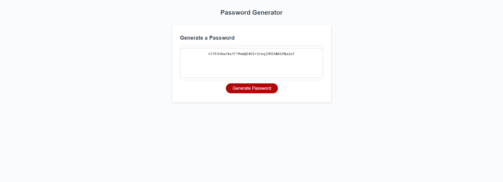

# password-generator

# Description
This project is a password generator that asks the user for input the then creates the password off the given constraints. Constraints include:
* Character length
* Numbers
* Lowercase letters
* Uppercase letters
* Special characters

Once all of these prompts are answered, then the password is displayed within the box.

[Deployed Website](https://mjlynch123.github.io/password-generator/)
